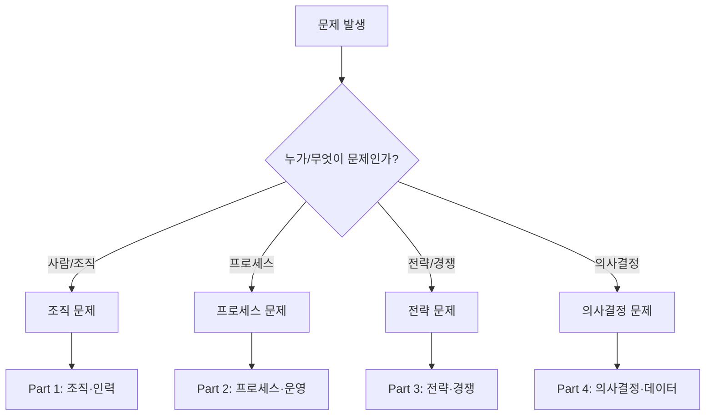

# BrainTwin 실무 워크플로우

문제 진단부터 횡단 분석까지 실전 적용 가이드

**↑ [[0_BrainTwin_Master_Index|BrainTwin 마스터 인덱스로 돌아가기]]**

---

## 📖 개요

이 문서는 BrainTwin을 **실제 비즈니스 문제에 적용**하는 구체적인 워크플로우를 제공합니다.

**포함 내용:**
1. 문제 유형별 진단 플로우차트
2. Part 횡단 워크플로우
3. 실전 시나리오
4. 도구 통합 가이드

---

## 🔍 Part 1: 문제 진단 플로우차트

### 시작점: 당신의 문제는?



---

### 조직 문제 진단

**증상 체크리스트:**
- [ ] 특정 사람에게 일이 몰림 → [[Part1_조직_인력/그래프 이론과 중심성|그래프 이론]]
- [ ] 중복 업무가 많음 → [[Part1_조직_인력/Rank와 Nullity]]
- [ ] 같은 문제가 반복됨 → [[Part1_조직_인력/군론과 대칭성]]

**진단 순서:**
1. 그래프 이론으로 병목 시각화
2. Rank-Nullity로 중복 정량화
3. 군론으로 반복 패턴 분석

---

### 프로세스 문제 진단

**증상 체크리스트:**
- [ ] KPI가 너무 많음 → [[Part2_프로세스_운영/SVD와 PCA]]
- [ ] 쓸데없는 업무가 많음 → [[Part2_프로세스_운영/Null Space 응용]]
- [ ] 같은 문제가 계속됨 → [[Part2_프로세스_운영/시스템 사고와 피드백 루프]]
- [ ] 고객 행동 예측 필요 → [[Part2_프로세스_운영/마르코프 체인]]
- [ ] 의사결정이 주관적 → [[Part2_프로세스_운영/베이즈 정리]]

---

### 전략 문제 진단

**증상 체크리스트:**
- [ ] 경쟁사와 교착 상태 → [[Part3_전략_경쟁/내쉬 균형]]
- [ ] 네트워크 효과 필요 → [[Part3_전략_경쟁/네트워크 효과와 플랫폼 경제학]]
- [ ] 리스크 관리 필요 → [[Part3_전략_경쟁/포트폴리오 이론]]
- [ ] 임계점 돌파 필요 → [[Part3_전략_경쟁/Phase Transition]]
- [ ] 실제 행동 이해 → [[Part3_전략_경쟁/행동경제학]]

---

### 의사결정 문제 진단

**증상 체크리스트:**
- [ ] 원인 규명 필요 → [[Part4_의사결정_데이터/인과 추론]]
- [ ] A/B 테스트 필요 → [[Part4_의사결정_데이터/실험과 학습]]
- [ ] 불확실성 측정 → [[Part4_의사결정_데이터/엔트로피]]
- [ ] 자원 배분 최적화 → [[Part4_의사결정_데이터/최적화 이론]]
- [ ] 순차적 의사결정 → [[Part4_의사결정_데이터/동적 계획법과 강화학습]]
- [ ] 극단 리스크 대비 → [[Part4_의사결정_데이터/극값 이론]]

---

## 🔄 Part 2: 횡단 워크플로우

### 워크플로우 1: 조직 최적화 전체 프로세스

**목적:** 조직 구조 문제를 체계적으로 해결

**단계:**
1. **Part 1: 병목 식별** (1-2일)
   - [[Part1_조직_인력/그래프 이론과 중심성|그래프 이론]]으로 업무 흐름 시각화
   - 중심성 계산으로 병목 노드 식별

2. **Part 2: 프로세스 최적화** (3-5일)
   - [[Part2_프로세스_운영/Null Space 응용|Null Space]]로 비효율 업무 제거
   - [[Part2_프로세스_운영/SVD와 PCA|SVD]]로 핵심 성과 지표 압축

3. **Part 3: 전략 재설계** (1주)
   - [[Part3_전략_경쟁/내쉬 균형|내쉬 균형]]으로 인센티브 구조 재설계
   - 병목이 새로운 균형을 만들지 않도록 설계

4. **Part 4: 효과 검증** (2-4주)
   - [[Part4_의사결정_데이터/실험과 학습|A/B 테스트]]로 개선 효과 측정
   - [[Part2_프로세스_운영/베이즈 정리|베이즈]]로 지속적 업데이트

**예상 결과:**
- 병목 제거로 처리 속도 30-50% 향상
- 중복 업무 제거로 인력 효율 20-30% 개선
- 구조적 해결로 재발 방지

---

### 워크플로우 2: 데이터 기반 의사결정

**목적:** 주관적 의사결정을 객관화

**단계:**
1. **Part 4: 원인 규명** (1-2주)
   - [[Part4_의사결정_데이터/인과 추론|인과 추론]]으로 진짜 원인 찾기
   - 혼재 변수 통제

2. **Part 2: 전략 가설 수립** (1주)
   - [[Part2_프로세스_운영/베이즈 정리|베이즈 정리]]로 초기 믿음 설정
   - 사전 확률 정의

3. **Part 4: 실험과 학습** (2-4주)
   - [[Part4_의사결정_데이터/실험과 학습|Multi-Armed Bandit]]으로 실시간 최적화
   - 데이터 수집 및 전략 업데이트

4. **Part 3: 리스크 관리** (진행 중)
   - [[Part3_전략_경쟁/포트폴리오 이론|포트폴리오 이론]]으로 리스크 분산
   - [[Part4_의사결정_데이터/극값 이론|극값 이론]]으로 극단 시나리오 대비

**예상 결과:**
- 주관적 의견 → 데이터 기반 결정
- 불확실성 정량화 (95% 신뢰구간)
- 리스크 관리 체계 구축

---

### 워크플로우 3: 프로세스 혁신

**목적:** 반복되는 비효율 근본 해결

**단계:**
1. **Part 2: 구조 분석** (1주)
   - [[Part2_프로세스_운영/시스템 사고와 피드백 루프|시스템 사고]]로 피드백 구조 파악
   - 강화 루프 (악순환) 식별

2. **Part 1: 병목 제거** (1-2주)
   - [[Part1_조직_인력/그래프 이론과 중심성|그래프 이론]]으로 병목 찾기
   - 병목이 피드백 루프의 일부인지 확인

3. **Part 2: 비효율 제거** (2-3주)
   - [[Part2_프로세스_운영/Null Space 응용|Null Space]]로 무의미한 활동 식별
   - 제거 가능한 프로세스 삭제

4. **Part 4: 지속적 개선** (진행 중)
   - [[Part4_의사결정_데이터/동적 계획법과 강화학습|강화학습]]으로 적응적 최적화
   - 주기적 재평가

**예상 결과:**
- 악순환 루프 차단
- 프로세스 시간 40-60% 단축
- 구조적 개선으로 재발 방지

---

### 워크플로우 4: 전략 수립

**목적:** 경쟁 우위 확보 전략

**단계:**
1. **Part 3: 경쟁 구도 분석** (1-2주)
   - [[Part3_전략_경쟁/내쉬 균형|내쉬 균형]]으로 현재 균형 파악
   - [[Part3_전략_경쟁/행동경제학|행동경제학]]으로 실제 행동 예측

2. **Part 3: 임계점 식별** (1주)
   - [[Part3_전략_경쟁/Phase Transition|Phase Transition]]으로 임계점 찾기
   - 언제 집중 투입할지 결정

3. **Part 4: 자원 배분** (1-2주)
   - [[Part4_의사결정_데이터/최적화 이론|최적화 이론]]으로 최적 배분
   - [[Part3_전략_경쟁/포트폴리오 이론|포트폴리오 이론]]으로 리스크 관리

4. **Part 4: 실행 및 검증** (진행 중)
   - [[Part4_의사결정_데이터/실험과 학습|A/B 테스트]]로 효과 검증
   - 실시간 전략 조정

**예상 결과:**
- 경쟁 우위 확보
- 최적 자원 배분
- 리스크 관리된 전략 실행

---

## 📋 Part 3: 실전 시나리오

### 시나리오 1: 조직 재편

**상황:** 100명 규모 조직, 프로젝트 지연 심각

**적용 워크플로우:** 조직 최적화

**Day 1-2:**
- 그래프 이론으로 업무 흐름 시각화
- 중심성 계산: 팀장 A의 betweenness centrality가 압도적

**Day 3-5:**
- Null Space 분석: 20% 업무가 결과에 무기여
- SVD로 성과 지표 압축: 15개 → 3개 핵심 지표

**Week 2:**
- 내쉬 균형 분석: 팀장 A가 권한을 포기하지 않는 이유
- 인센티브 재설계: 위임 시 평가 가점

**Week 3-4:**
- A/B 테스트: 권한 위임 전/후 비교
- 결과: 프로젝트 완료 시간 40% 단축

---

### 시나리오 2: 신제품 출시 의사결정

**상황:** 3개 제품 후보, 어떤 것을 먼저 출시할까?

**적용 워크플로우:** 데이터 기반 의사결정

**Week 1:**
- 인과 추론: 과거 성공 제품의 진짜 요인 분석
- 베이즈: 초기 성공 확률 추정 (각 제품별)

**Week 2-4:**
- Multi-Armed Bandit: 시장 테스트로 실시간 학습
- 제품 A: 전환율 5% → 더 많은 트래픽 할당
- 제품 B: 전환율 2% → 트래픽 감소
- 제품 C: 전환율 4%

**Week 5:**
- 포트폴리오 이론: A+C 조합으로 리스크 분산
- 극값 이론: 최악 시나리오 대비 (VaR 계산)

**결과:** 제품 A를 주력으로, C를 보조로 출시. 기회비용 최소화

---

### 시나리오 3: 비용 절감 프로젝트

**상황:** 운영 비용 20% 절감 목표

**적용 워크플로우:** 프로세스 혁신

**Week 1:**
- 시스템 사고: 비용 증가의 피드백 루프 발견
  - 압박 → 품질 저하 → 재작업 → 비용 증가 → 더 큰 압박

**Week 2:**
- 그래프 이론: 재작업이 많은 프로세스 단계 식별
- Null Space: 결과에 기여하지 않는 검토 단계 발견

**Week 3-4:**
- 구조 변경: 초기 품질 검증 단계 추가 (악순환 차단)
- 비효율 프로세스 제거: 7단계 → 4단계

**Week 5-8:**
- 강화학습: 프로세스 지속 최적화
- 베이즈 업데이트: 효과 측정 및 개선

**결과:** 운영 비용 25% 절감 (목표 초과), 품질도 15% 향상

---

## 🛠️ Part 4: 도구 통합

### Python 통합

**그래프 이론:**
```python
import networkx as nx

# 조직 그래프 생성
G = nx.DiGraph()
G.add_edges_from([('A', 'B'), ('A', 'C'), ('B', 'D')])

# 중심성 계산
betweenness = nx.betweenness_centrality(G)
print(f"병목 노드: {max(betweenness, key=betweenness.get)}")
```

**SVD/PCA:**
```python
from sklearn.decomposition import PCA
import pandas as df

# KPI 데이터 로드
data = pd.read_csv('kpi_data.csv')

# PCA 적용
pca = PCA(n_components=3)
reduced = pca.fit_transform(data)

print(f"설명된 분산: {pca.explained_variance_ratio_}")
```

**베이즈 정리:**
```python
# 사전 확률
prior = 0.5

# 데이터 관찰
successes = 68
trials = 100

# 사후 확률 (베타 분포)
from scipy.stats import beta
posterior = beta(successes + 1, trials - successes + 1)

print(f"사후 평균: {posterior.mean():.2%}")
print(f"95% 신뢰구간: [{posterior.ppf(0.025):.2%}, {posterior.ppf(0.975):.2%}]")
```

---

### Excel 통합

**그래프 이론:**
- Power Query로 업무 흐름 데이터 정리
- PowerBI로 네트워크 시각화

**SVD/PCA:**
- Data Analysis Toolpak의 상관관계 분석
- 산점도 매트릭스로 시각화

**최적화:**
- Solver Add-in으로 선형계획법
- 제약 조건 설정 및 최적해 찾기

---

### Obsidian 통합

**링크 그래프:**
- Obsidian Graph View로 개념 연결 시각화
- 자주 사용하는 워크플로우를 MOC(Map of Content)로 정리

**Dataview 쿼리:**
```javascript
// 특정 Part의 모든 개념 나열
TABLE file.name AS "개념", tags AS "태그"
FROM "3-Resources/Part1_조직_인력"
WHERE file.name != "0_Part1_Organization_Index"
SORT file.name ASC
```

---

## ✅ 불변량 준수 확인

이 워크플로우는 BrainTwin의 5가지 불변량을 준수합니다:

| 불변량 | 적용 방식 |
|--------|----------|
| **1. 복잡성 단순화** | 진단 플로우차트로 명확한 경로 제시 |
| **2. 데이터 기반** | 모든 워크플로우가 측정 가능한 결과 |
| **3. 구조적 사고** | 증상이 아닌 근본 원인 해결 |
| **4. 점진적 개선** | 각 워크플로우에 검증 및 개선 단계 포함 |
| **5. 실용주의** | 실전 시나리오로 즉시 적용 가능 |

---

**마지막 업데이트**: 2026-01-10

**통합 문서**: Cross-Part Workflows, Problem Diagnosis, Real World Scenarios, Toolkit Integration을 통합

---

#braintwin #workflows #실전 #적용 #통합
